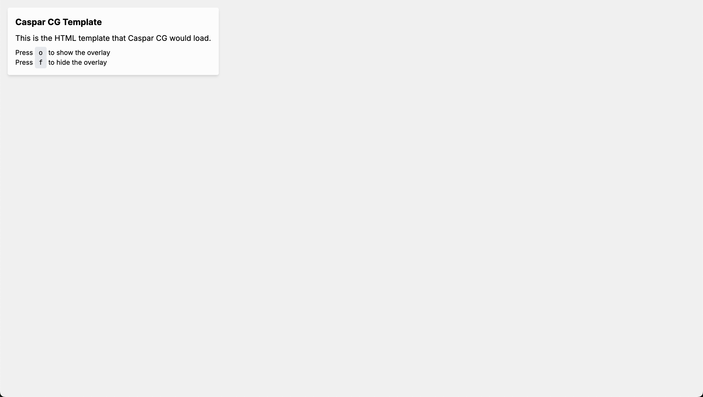

# BBC News Clock System

## Preview

Here’s a quick look at the interface and output:

### Control Interface


### CasparCG Template (Empty State)



### CasparCG Template (With Overlay)


## Introduction

This project is a custom application built to automatically update the "News Clock" shown on the BBC News Channel's lower thirds (strap). It ensures the time shown on screen remains accurate, enhancing the broadcast's professional appearance.

The app works as a client-server system: a TCP client communicates with CasparCG via the AMCP protocol to control graphics, while a separate HTML/JavaScript interface handles the on-screen visuals.

It's built using Next.js, React, TypeScript, and Tailwind CSS—modern technologies that help provide a reliable and flexible solution.

## Solution Overview

The project is structured around two main deliverables outlined in the brief:

1. **Task 1 – API Component:** A TCP client built in Node.js that communicates with CasparCG using AMCP.
2. **Task 2 – UI Component:** A lower-thirds graphic template built with HTML and JavaScript.

### Key Features

- Automatically updates the clock every minute on the minute
- Manual controls to show/hide overlay and refresh the clock
- Toggle to enable or disable auto-updates
- Connection and status monitoring
- Responsive web interface for control
- Standalone HTML template for CasparCG

## My Approach

Here’s how I tackled the brief:

1. **Clear Separation of Concerns:** I separated the TCP socket logic from the visual UI layer to keep responsibilities distinct.
2. **Server-side TCP Handling:** TCP socket communication lives on the server side to avoid browser security issues.
3. **Simple Web Control Panel:** Built with React and Tailwind, the control UI provides an easy way to monitor and interact with the system.
4. **Graceful Error Handling:** I added logic for connection failures and runtime errors to make the system resilient.
5. **Environment Awareness:** The app detects whether it's running on the server or in the browser and behaves accordingly.

## Tech Stack

- **Frontend:** React with Next.js
- **Backend:** Node.js TCP socket client
- **Language:** TypeScript throughout
- **Styling:** Tailwind CSS
- **Protocol:** AMCP (Advanced Media Control Protocol) for CasparCG
- **Testing:** Jest and React Testing Library
- **Hosting:** Vercel (for web interface only)

## Implementation Details

### API Component (TCP Client)

Located in `lib/caspar/client.ts`, this handles:

- Opening a TCP connection to CasparCG
- Sending AMCP commands
- Scheduling time updates
- Managing internal state

Startup process:

1. Connects to CasparCG on localhost
2. Sends `CG 1 ADD 1 main/MAIN 1` to load the template
3. Every minute, sends:
   ```
   CG 1 INVOKE 1 "leftTab('on', 'BBC NEWS HH:MM')"
   ```

### UI Component

**Control Interface (`app/page.tsx`)**

- Shows current connection status and active time
- Buttons for update, show/hide, and toggle auto mode

**Caspar Template (`app/template/page.tsx` + `public/templates/caspar-news-clock.html`)**

- Exposes a global `leftTab` function
- Handles show/hide animations
- Updates text based on input parameters

## Challenges & Limitations

1. **Deployment:** TCP connections don’t work on platforms like Vercel. A dedicated backend is needed for full deployment.
2. **Browser Constraints:** The browser can't open TCP sockets due to security restrictions.
3. **Testing TCP Logic:** Requires a real or mocked CasparCG server to test effectively.
4. **Error Recovery:** While some handling exists, a production-grade failover strategy would need further work.
5. **UI Simplicity:** The current overlay is functional but basic. More complex graphics would need further build-out.

## Future Improvements and Roadmap

As broadcasting tech evolves, there's definitely room to push this further. A few ideas and observations:

### Future Use Cases

- **Multi-Channel Support**: At the moment, everything is hardcoded for one channel. I'd refactor this to allow config-driven support for multiple channels or even different CasparCG instances.
- **Advanced Graphics**: The current template is basic. In future, I’d like to support richer graphics and multiple layouts.
- **Scheduled Graphics**: Real-time control works, but having a way to queue and trigger pre-set graphics on a schedule would make this more broadcast-friendly.
- **NRCS Integration**: Systems like iNews or ENPS drive newsroom workflows. I’d explore adding API hooks or MOS protocol support to receive live instructions.
- **Remote Access**: Right now, it assumes you're on the same network. I'd add secure remote access with login controls for distributed teams.

### Codebase Limitations

- **TCP Reconnection**: The socket logic could be more resilient—I’d like to add proper reconnection, heartbeats, and error recovery.
- **State Management**: Right now it's a mix of hooks and server vars. I’d move to a centralised store like Zustand or Redux to futureproof.
- **Testing Depth**: Unit coverage is okay, but full end-to-end and integration testing with a mock CasparCG server is still on the to-do list.
- **Config Handling**: A lot of things are hardcoded or only changeable via `.env`. I’d switch to config files or a lightweight settings UI.
- **Logging**: At the moment it just logs to the console. I'd build in structured logging with severity levels and push to a monitoring tool.

### Implementation Plans

- **Split Architecture**: I'd extract the TCP client into a separate service, add REST endpoints, and wire it up to the UI securely. This would also make it easier to deploy in different environments.
- **WebSockets**: Polling works, but I'd move to WebSockets for real-time communication.
- **Template Management**: I'd like to make templates more flexible. Having a config schema, a UI for editing, and versioning would help.
- **User Roles**: Adding authentication (maybe with NextAuth) and basic role-based access would be useful for production use.
- **Monitoring**: Building proper observability is a priority—logs, metrics, alerts. Tools like Pino for logging and Prometheus/Grafana for visualisation come to mind.

### Scalability Thoughts

- **Horizontal Scaling**: I’d make the TCP client stateless and share the state in something like Redis to allow multiple instances to run safely.
- **Performance Tuning**: I'd keep an eye on response times and bottlenecks, especially as more templates or channels get added.
- **Persistence Layer**: Right now there's no DB. In future I’d add PostgreSQL or Mongo to store templates, logs, and schedules.

## Getting Started

Here's your `README.md` file formatted for download:

```markdown file="README.md"
...
```

### 1. Install dependencies

```shell
npm install
# or
yarn install
```

### 2. Create environment variables

Create a `.env.local` file in the root directory and add the following:

```env
CASPAR_HOST=localhost
CASPAR_PORT=5250
```

### 3. Run the development server

```shell
npm run dev
# or
yarn dev
```

Open [http://localhost:3000](http://localhost:3000) in your browser to use the control interface.

### Testing with Netcat (Alternative to CasparCG)

If you don't have CasparCG running, you can simulate it using netcat:

**On macOS/Linux:**

```shell
nc -l 5250
```

**On Windows (using PowerShell):**

```shell
ncat.exe -l -p 5250
```

> Note: You may need to install [Ncat](https://nmap.org/ncat/) from the Nmap suite.

Now interact with the UI and observe AMCP commands received by netcat.

## Testing

To run tests:

```shell
npm test
# or
yarn test
```

Test coverage includes:

- Unit tests for the TCP client
- Component tests for the control interface
- Mocked TCP socket behaviour for testing without CasparCG
